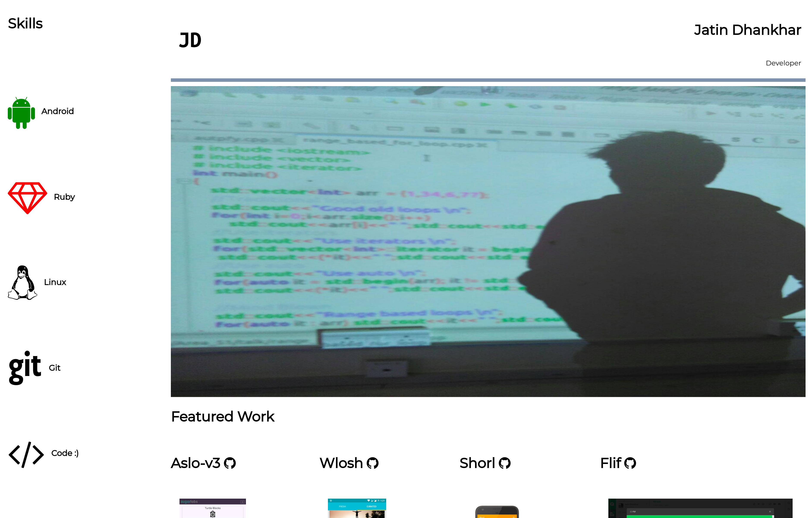
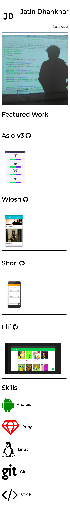
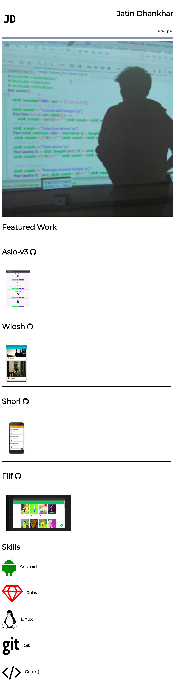

# udacity-fend-portfolio
Project Submission for Udacity's Front End Nanodegree - Portfolio Project

## What I learned
I learned about 
1. Flex box model
2. Image responsiveness
3. Media Queries
4. Appreciation for frameworks like Foundation and Bootstrap :smile:

# [Demo](https://jatindhankhar.in/udacity-fend-portfolio)

# Screenshots
## Desktop 

# Mdpi Screens
| Nexus 5        | iPad           |
| ------------- |:-------------:|
| | |

  

